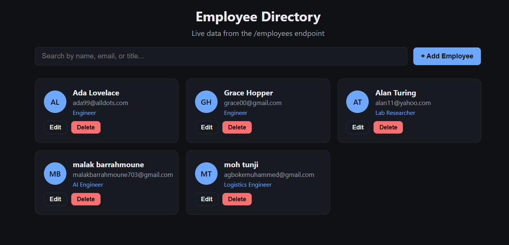

# Employee Service

A RESTful web service for managing a company employee directory, built with Java Spring Boot. This project was built as a learning exercise for using Spring Boot and designing a service intended for deployment on HPE GreenLake private cloud.

## Features

- Full CRUD REST API: GET, POST, PUT, and DELETE
- Data fields match the required schema: employee_id, first_name, last_name, email, title
- Input validation (required fields, valid email format)
- A built-in web UI for browsing, searching, adding, editing, and deleting employees
- Local development database (H2), designed to be swapped for PostgreSQL in production

## Tech Stack

- Java 25
- Spring Boot 4.1.1 (Web, Data JPA, Validation)
- H2 in-memory database (local/dev)
- Vanilla HTML/CSS/JS frontend (no build tools required)

## Getting Started

Run locally with:

    ./mvnw spring-boot:run

Once you see "Started EmployeeServiceApplication", open:

- http://localhost:8080/ for the web UI
- http://localhost:8080/employees for the raw JSON API

Sample employees are loaded automatically on first run.

## API Reference

All endpoints are under /employees.

| Method | Path | Description |
|---|---|---|
| GET | /employees | Returns all employees as Employees: [...] |
| POST | /employees | Creates a new employee |
| PUT | /employees/{employee_id} | Updates an existing employee |
| DELETE | /employees/{employee_id} | Removes an employee |

## Deployment Notes

For production, this service is designed to run on HPE GreenLake private cloud:

- Swap the H2 database for PostgreSQL
- Package the application as a Docker image
- Deploy to a GreenLake-provisioned VM or container environment
- Restrict network access to internal traffic only

